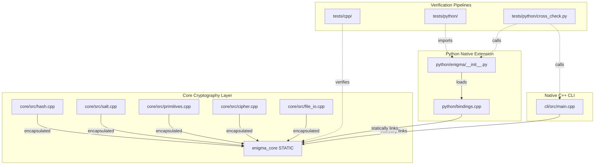

# Monorepo Architecture

Enigma is configured as a C++ monorepo built using a unified CMake configuration, bundled with python bindings compiled using `scikit-build-core`.

---

## 🗺️ Codebase Map

All cryptographic algorithms reside in the core library and are statically linked by the frontends.

```
enigma/
├── CMakeLists.txt              # Unified root CMake config
├── pyproject.toml              # scikit-build-core python extension packaging
│
├── core/                       # ✅ SINGLE SOURCE OF TRUTH (C++ Static Library)
│   ├── CMakeLists.txt          # Defines 'enigma_core' library target
│   ├── include/enigma/
│   │   ├── hash.h              # Hashing declarations
│   │   ├── cipher.h            # Cipher declarations
│   │   └── primitives.h        # Low-level bitwise declarations
│   └── src/
│       ├── hash.cpp            # Custom password hashing logic
│       ├── salt.cpp            # CSPRNG generator (Windows Advapi32/Linux /dev/urandom)
│       ├── primitives.cpp      # Whole-buffer bitwise shifts & rotations
│       ├── cipher.cpp          # Symmetric encryption block-level wrapper
│       └── file_io.cpp         # Chunked C++ stream file reader/writer
│
├── cli/                        # Native C++ CLI executable
│   ├── CMakeLists.txt          # Defines 'enigma' executable target
│   └── src/main.cpp            # CLI command parser and Unicode Windows converter
│
├── python/                     # pybind11 Python Native Module
│   ├── CMakeLists.txt          # Configures pybind11 FetchContent
│   ├── bindings.cpp            # C++ pybind11 exports & error translations
│   └── enigma/
│       ├── __init__.py         # Re-exports compiled C++ module
│       └── __init__.pyi        # PEP 561 static type signature stubs
│
└── tests/                      # Unified Test Suites
    ├── cpp/                    # GoogleTest / Standard C++ unit tests
    └── python/                 # Pytest suite & CLI/Python cross-compatibility verification
```

---

## ⚙️ Component Interaction

The diagram below details how C++ static modules link into the dynamic python binders and binary executables:



---

## 🔗 Key C++ File References

For developers auditing or extending Enigma, these are the core files to investigate:
*   [core/src/hash.cpp](file:///r:/Coding/Projects/Encryption/enigma/core/src/hash.cpp): Contains the custom password stretching algorithm with state arrays.
*   [core/src/cipher.cpp](file:///r:/Coding/Projects/Encryption/enigma/core/src/cipher.cpp): Owns the `ENIGMA01` file header writing and password verification tag logic.
*   [core/src/primitives.cpp](file:///r:/Coding/Projects/Encryption/enigma/core/src/primitives.cpp): Core math functions for rotating whole 1024-byte memory buffers.
*   [python/bindings.cpp](file:///r:/Coding/Projects/Encryption/enigma/python/bindings.cpp): Binds Python parameters, validates memory structures, and converts C++ errors (`std::runtime_error`) into Pythonic `ValueError` or `IOError` structures.
