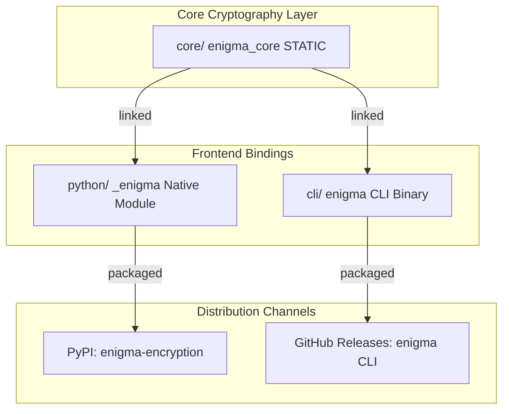

# Introduction to Enigma

Welcome to the **Enigma** developer portal. 

Enigma is a modern, zero-dependency cryptography monorepo featuring a high-performance C++17 core, a standalone command-line interface (CLI), and native Python bindings.

---

## Key Features

* **Zero-Dependency Core**: Written in clean, modern C++17 with no runtime dependencies on heavy frameworks like OpenSSL.
* **Hybrid Build Architecture**: Utilizes `scikit-build-core` and CMake to compile pybind11 C++ code into binary Python wheels automatically.
* **Symmetric Bitwise Cipher**: Employs an iterated, block-level bitwise rotation and XORing scheme to encrypt and decrypt arbitrary files or byte streams.
* **Hardened Password Hashing**: Implements a memory-hard iteration system that resists brute-force and dictionary attacks.
* **Full Cross-Compatibility**: Anything encrypted by the C++ CLI tool can be seamlessly decrypted by the Python library (and vice versa).

---

## Core Components

The repository is structured logically to ensure all cryptographic logic resides in a single, auditable location:

1. **`core/`**: The core static library (`libenigma_core`). Handles the low-level memory hashing arrays, bit rotation primitives, file chunk parsing, and key-derivation.
2. **`cli/`**: A native executable wrapper exposing commands to hash strings, encrypt files, and decrypt them.
3. **`python/`**: Native extension bindings (`pybind11`) that build and pack the code into the `enigma-encryption` package on PyPI.
4. **`tests/`**: Parallel test suites for C++ (`ctest`) and Python (`pytest`) ensuring mathematical algorithm parity on every single commit.
